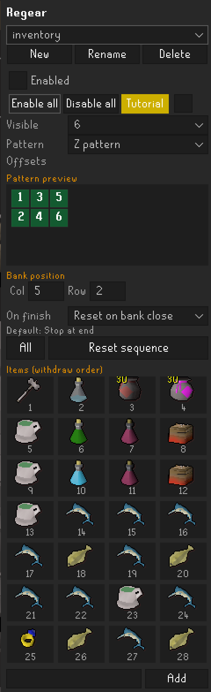
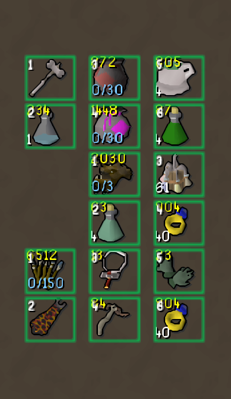
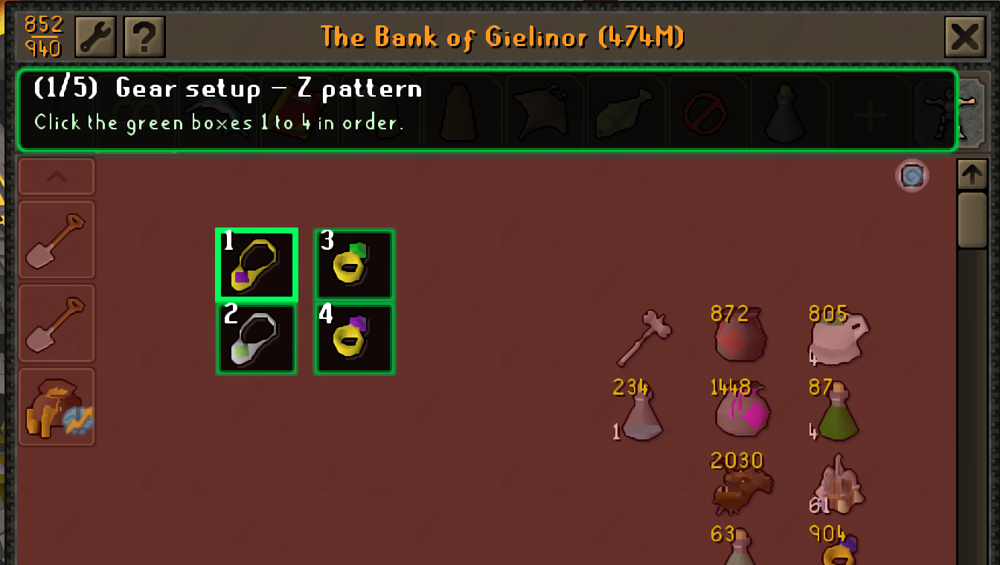

  

# Regear

A banking helper for RuneLite. You build the gear or inventory you want in a side panel, pick a
layout style, and Regear shows those items in fixed bank slots so you can withdraw them in the order
you set. It works like other banking plugins: it filters the bank and puts the next items where you
expect them. It does not click, withdraw, or move anything for you.

## What it does

- Build ordered lists ("setups") in the side panel: a full 28-slot regear, a repot, a spec switch,
  or anything you withdraw the same way each time.
- When the bank is open, each enabled setup shows a small rotating window of its items in set
  positions, so you click the same few slots in a rhythm. Several setups can be enabled at once and
  each gets its own window.
- The setup dropdown is a checklist. Tick a checkbox to enable or disable a setup and the menu stays
  open so you can set a few in a row. Click a name to select it for editing. Enable all / Disable all
  bulk-toggle everything.
- Group your setups. Enable the setups you want, hit "Group checked" to save them as a named group,
  then Enable group / Disable group to switch the whole lot in one click. "Update group" pushes your
  current selection onto the group, and there's Rename and Delete. Renaming a setup doesn't break
  its groups.
- Show 1 to 28 slots at once, in a single spot, a vertical line, a Z block, or your own custom
  layout. The pattern preview is a bank-style grid with a "Click to set" toggle, so you can click
  cells to build a custom layout directly. Bank position lets you set the anchor slot and Col/Row
  offsets per setup.
- Set a withdraw amount per item. A rune set to 30 stays put until you have pulled all 30.
- Add "or" alternatives per item, like a fresh and a used piece of gear, or several potion doses. It
  shows whichever one you own, and you can order the fallbacks.
- "Skip if worn" hides an item while you are already wearing it. "Omit" skips an entry but keeps it
  in place as a placeholder. "Add blank space" puts a deliberate empty inventory slot in the list.
- Right-click an entry for Set amount, Set note, Duplicate, Edit item id, Remove, and Move left /
  Move right.
- "Add current inventory" dumps everything you're holding into the selected setup in slot order.
- Import / Export / Export all setups as clipboard text, to move them between profiles or send them
  to someone else.
- A movable equipment panel that mirrors what you're wearing while the bank is open, in the game's
  equipment layout. Updates live as you gear up.
- Hide overlay / Show overlay to browse the bank without the guide in the way.
- An item id overlay and a right-click "Add to Regear" for building lists.
- A short tutorial that walks you through the patterns on your own bank.

The next items are worked out from what is actually in your inventory, so a misclick or a double
withdraw sorts itself out.

## In the bank

Active slots get a coloured box, the slot to click next gets its own colour and moves through the
order in real time, and lanes are numbered. There's an optional preview of the item each lane
advances to next. All the colours are configurable.

If an item isn't in the bank you get a missing marker and a "Missing:" line in the panel; you can
either wait for it or set the plugin to skip past it. Overlapping patterns get a warning too.
Reset sequence puts a setup back to the start, and "All" resets every setup.

When a setup runs out you can stop at the end, loop back to the start, reset when the bank closes,
reset when the inventory changes, or reset by hand.

Regear drives the core Bank Tags plugin's layouts, so it needs Bank Tags enabled.

## Screenshots

## Adding items

Right-click a bank, inventory, or worn item and choose "Add to Regear", or type an item id in the
panel. If you want to look up ids, the Item ID and Lookup plugin does that.

## Settings

**Bank display**

- Show setups in bank: filter the bank to your enabled setups and move the items into position. Off
  keeps your setups but leaves the bank alone.
- Default visible items: how many lanes a new setup starts with. 28 is a full inventory.
- Highlight active slots, Slot boxes, Current click, Show lane numbers, Show next item.

**Overlays**

- Item id overlay: draw each item's id over bank, inventory and equipment items. Also a checkbox in
  the panel.
- Mark missing items and Missing marker colour.
- Hide bank guide: same as the Hide overlay button.

**Equipment panel**

- Show equipment while banking: the movable worn-equipment panel. Also a checkbox in the panel.

**Behaviour**

- When a list finishes: Stop at end, Loop to start, Reset on bank close, Reset on inv change, Manual
  reset. Applies to every setup.
- Hold after withdraw (ticks): after you take an active item, keep that slot empty for this many
  ticks so mashing a slot only pulls one item at a time, in order. 0 is fastest.
- Skip missing items: advance past an item that isn't in the bank instead of waiting on it.
- Prevent bank item drag: raises the item drag delay while the bank is open so fast withdraw clicks
  aren't read as drags. Same setting the Anti-Drag plugin uses. 0 leaves the client default.

**Other**

- Open Regear panel: ticking it opens the panel, then it unticks itself.
- Hide tutorial button: hides the Tutorial button in the panel.

## Note

Display only. Regear never automates gameplay. You perform every click.
